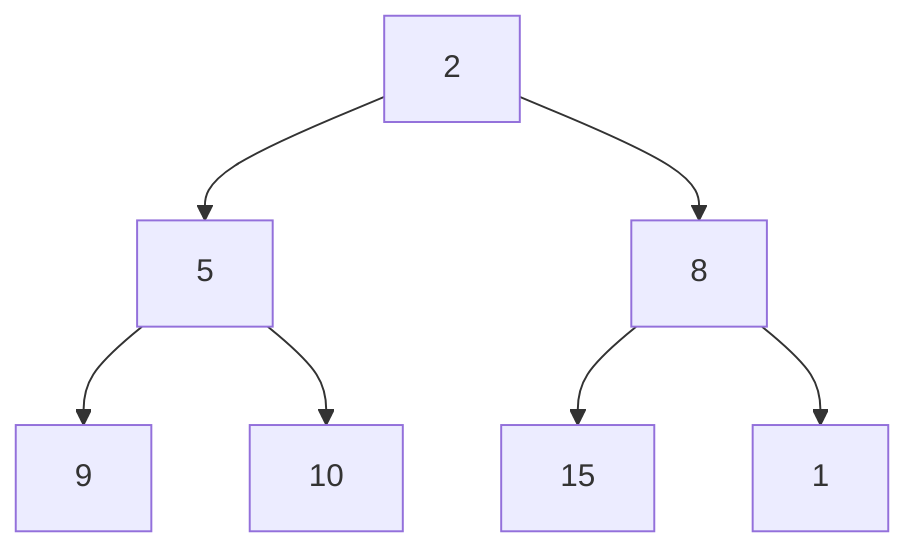
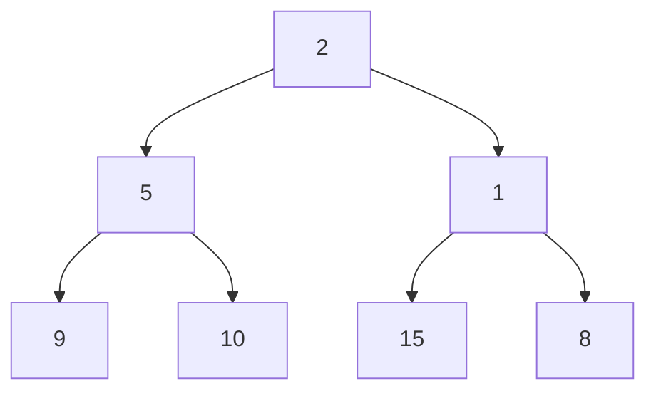
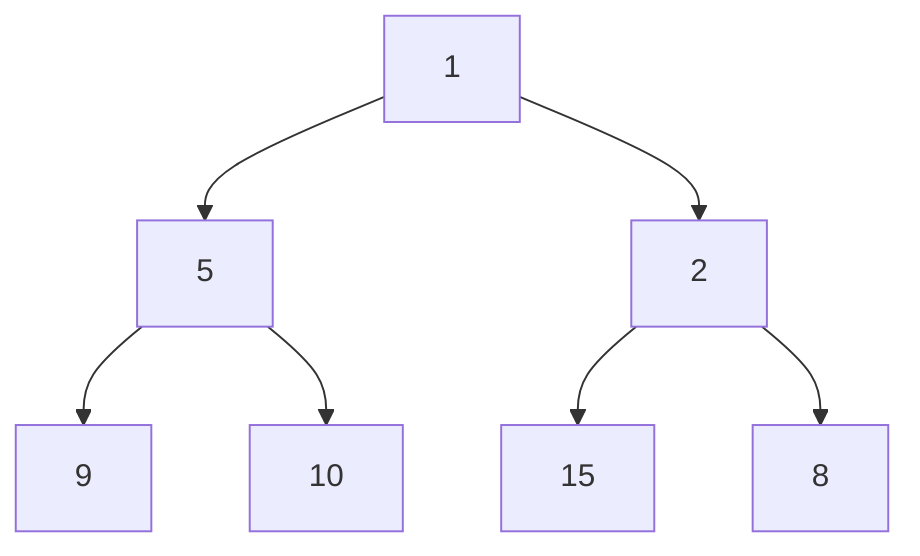
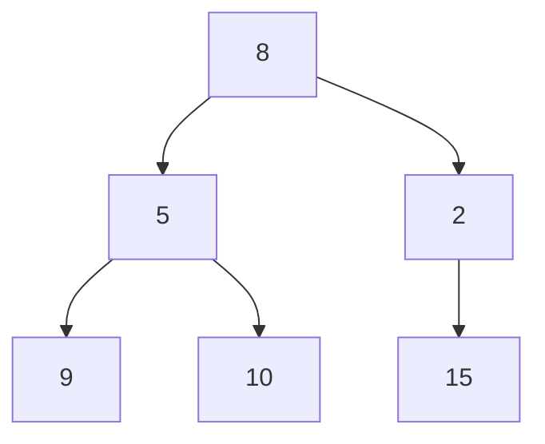
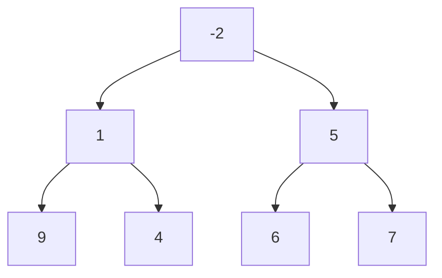

# 📅 Day 6 — Heaps (Mermaid Visual Diagrams)

This file contains heap visuals that render automatically
in GitHub and VS Code (with Mermaid support).

---

# 1️⃣ Basic Min-Heap Structure


Heap Invariant:
Parent ≤ Children

---

# 2️⃣ Array Representation Mapping

Array:

```
[2, 5, 8, 9, 10, 15]
```

Index Rules:

- Left Child  = 2*i + 1
- Right Child = 2*i + 2
- Parent      = (i - 1) // 2

---

# 3️⃣ Insert Operation (Bubble Up)

Insert value = 1

Initial placement:



Swap with parent (8):



Swap with parent (2):



Time Complexity: O(log N)

---

# 4️⃣ Remove Top (Sink Down)

Remove root (1)

Swap with last element:



Swap with smaller child (2):


Heap property restored.

Time Complexity: O(log N)

---

# 5️⃣ Build Heap (Bottom-Up Heapify)

Initial array:

```
[9, 4, 7, 1, -2, 6, 5]
```

Final Min-Heap:



Why O(N)?

Because:
- Lower nodes are many but shallow
- Upper nodes are few but deep
- Total swaps form a geometric series

---

# 6️⃣ Two-Heaps Model (Median of Data Stream)

```mermaid
graph LR

    subgraph MaxHeap (Left Half)
        A1[10]
        A2[5]
        A3[3]
    end

    subgraph MinHeap (Right Half)
        B1[12]
        B2[15]
        B3[20]
    end
```

Invariant:
All elements in MaxHeap ≤ All elements in MinHeap

Median:
- If sizes equal → average of roots
- If not → root of larger heap

---

# 7️⃣ Heap Height Visualization

If N = 15:

Height ≈ log₂(15) ≈ 4

Each insert/remove moves at most height levels.

That is why operations are logarithmic.

---

# ✅ Summary

Heap Guarantees:
- Complete binary tree
- Parent-child ordering
- Fast access to extreme element

Heap Does NOT Guarantee:
- Full sorting
- Ordered traversal

Use Heap When:
- You need repeated min/max
- You need Top-K
- You need priority scheduling
- You process streaming data

---