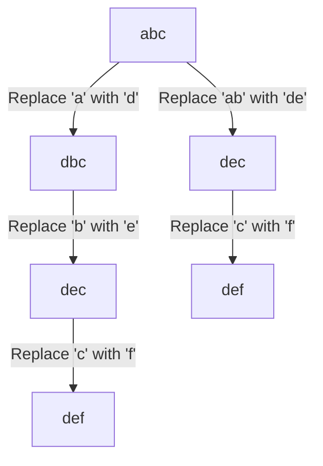

<!--
Following Problem_Instructions.md, start generating tenth problem from Set1-ProgramList.md, which is 10️⃣ Minimum Edit Distance with Substring Replacement, and then update the Concept Coverage Check table at the end of the file to include the new problem's concepts. Ensure that the problem statement is clear, concise, and includes the twist as described in the list. After generating the problem, review the Concept Coverage Check table to confirm that it accurately reflects the concepts covered by all problems listed, including the new one.

Questions must be in Hackerrank style, with a clear problem statement, input/output format, and constraints. The problem should be designed to test the understanding of dynamic programming concepts, specifically string DP and state augmentation due to the substring replacement twist. Make sure to maintain the formatting consistency with the existing problems in the file.

Follow thw twist accurately to make it new, and more challenging than the standard edit distance problem, ensuring that it requires a new insight or approach to solve effectively. After writing the problem, update the Concept Coverage Check table to include "String DP" and "State augmentation" for this new problem, and ensure that all other entries in the table are correct and up-to-date.
-->

# 10️⃣ Minimum Edit Distance with Substring Replacement

## Problem Statement

Given two strings `s1` and `s2`, calculate the minimum edit distance between them. The edit distance is defined as the minimum number of operations required to transform `s1` into `s2`, where the allowed operations are:

1. Insert a character
2. Delete a character
3. Replace a character
4. Replace any substring of `s1` with any substring of `s2` in one operation (this is the twist that differentiates this problem from the standard edit distance problem).
5. The substring replacement can be of any length, and the replaced substring can be different from the original substring.
6. The order of characters in the substrings must be maintained.

## Input Format

- The first line contains the string `s1`.
- The second line contains the string `s2`.
- Both strings consist of lowercase English letters and have lengths between 1 and 1000.
- The total length of both strings combined will not exceed 2000.
- You can assume that the input strings are non-empty.
  
## Output Format

- Print a single integer representing the minimum edit distance between `s1` and `s2` considering the allowed operations.
- If it is not possible to transform `s1` into `s2` using the allowed operations, print -1.
- Note: The substring replacement operation can significantly reduce the number of edits required, so consider it carefully in your solution.

## Constraints

- 1 ≤ |s1|, |s2| ≤ 1000
- Total length of s1 and s2 combined ≤ 2000
- s1 and s2 consist of lowercase English letters only.

## Sample Input

```str
abcde
abfce
```

## Sample Output

```str
2
```

## Explanation(step by step)

- Replace 'c' in `s1` with 'f' in `s2`.
- Replace 'd' in `s1` with 'c' in `s2`.
- Total operations: 2
- Alternatively, you could replace the substring "cd" in `s1` with "fc" in `s2` in one operation, which would also result in a total of 2 operations.

## Test cases

**Note**: The test cases should cover various scenarios, including edge cases where the strings are identical, completely different, and cases where the substring replacement significantly reduces the number of edits. Test cases in table format, with columns for `s1`, `s2`, and `Expected Output`, `Detailed Explanation` for each case.

| s1       | s2       | Expected Output | Detailed Explanation                                                                                     |
| -------- | -------- | --------------- | -------------------------------------------------------------------------------------------------------- |
| abcde    | abfce    | 2               | Replace 'c' with 'f' and 'd' with 'c', or replace "cd" with "fc" in one operation.                    |
| a        | a        | 0               | Both strings are identical, so no operations are needed.                                                 |
| abc      | def      | 3               | Replace 'a' with 'd', 'b' with 'e', and 'c' with 'f'. No substring replacement can reduce the operations. |
| abc      | abcdef   | 3               | Insert 'd', 'e', and 'f' into `s1`. No substring replacement can reduce the operations. |
| abcdef   | abc      | 3               | Delete 'd', 'e', and 'f' from `s1`. No substring replacement can reduce the operations. |
| abc      | ac       | 1               | Replace 'b' with 'c'. No substring replacement can reduce the operations. |

## WHY DP for this problem?

**Note**: What other ways, if any, could be used to solve this problem? Why is DP the most efficient approach? Non- DP approcehs will be discued in detail in following sections.

### Non DP Approaches based on an extreme example to understand why DP is necessary

<!--
The point is to explain importance of DP to solve these kind of problems.

The examples should be taken in such a way that, it clearly fails with all other approaches(along with brute force) but can be solved with DP. The examples should be simple and easy to understand, and should clearly illustrate the limitations of non-DP approaches.

At each type of non-DP approach, we should explain why it fails with the example, and then move on to the next approach. This will help in building a strong case for why DP is necessary for solving this problem effectively. Include time, space , and auxiliary space complexity of each approach, and explain how DP optimizes these complexities compared to non-DP approaches.
 -->

### Brute Force Approach

- Generate all possible transformations of `s1` using the allowed operations and check if any of them matches `s2`.
- Time Complexity: O(3^n) in the worst case due to the exponential growth of possible transformations.
- Space Complexity: O(n) for the recursion stack.
- This approach is impractical for larger strings due to the exponential number of transformations.
- Example: For `s1 = "abc"` and `s2 = "def"`, the brute force approach would need to consider all combinations of insertions, deletions, replacements, and substring replacements, leading to a huge number of possibilities.
- The trace of example would show how the number of transformations grows exponentially, making it clear that this approach is not feasible for larger inputs.

#### Trace table for brute force approach for above example

| Step | s1 Transformation | Operation | Resulting s1 |
|------|-----------------|-----------|--------------|
| 1    | abc             | Replace 'a' with 'd' | dbc          |
| 2    | dbc             | Replace 'b' with 'e' | dec          |
| 3    | dec             | Replace 'c' with 'f' | def          |
| 4    | abc             | Replace 'ab' with 'de' | dec          |
| 5    | dec             | Replace 'c' with 'f' | def          |

- As we can see, the number of transformations grows rapidly, and this approach becomes infeasible for larger strings.
- The trace table illustrates the exponential growth of transformations, making it clear that a more efficient approach is needed.
  
#### Mermaid diagram for brute force approach for above example



### Backtracking Approach

- Similar to brute force but with some pruning to avoid unnecessary transformations.
- Time Complexity: O(3^n) in the worst case, similar to brute force, as it still explores a large number of transformations.
- Space Complexity: O(n) for the recursion stack.
- While backtracking can reduce the number of transformations explored, it still suffers from exponential growth in the worst case, making it impractical for larger strings.
- Example: For `s1 = "abc"` and `s2 = "def", backtracking would still need to explore many transformations, and the pruning may not be effective enough to significantly reduce the number of transformations.
- The trace of the example would show how backtracking explores different paths, but still ends up exploring a large number of transformations, illustrating its limitations.

#### Trace table for backtracking approach for above example

| Step | s1 Transformation | Operation | Resulting s1 |
|------|-----------------|-----------|--------------|
| 1    | abc             | Replace 'a' with 'd' | dbc          |
| 2    | dbc             | Replace 'b' with 'e' | dec          |
| 3    | dec             | Replace 'c' with 'f' | def          |
| 4    | abc             | Replace 'ab' with 'de' | dec          |
| 5    | dec             | Replace 'c' with 'f' | def          |

- The trace table illustrates that while backtracking may explore different paths, it still ends up exploring a large number of transformations, making it clear that a more efficient approach is needed.

#### Mermaid diagram for backtracking approach for above example


### Greedy Approach

### Dynamic Programming Approach

- Use a 2D DP table where `dp[i][j]` represents the minimum edit distance between the first `i` characters of `s1` and the first `j` characters of `s2`.
- Time Complexity: O(n*m) where n and m are the lengths of `s1` and `s2` respectively.
- Space Complexity: O(n*m) for the DP table.

## English to Code Mapping with detailed explanation of Approach, algorithm, and code implementation

### Approach

1. Initialize a 2D DP table `dp` of size (n+1) x (m+1) where n and m are the lengths of `s1` and `s2` respectively.
2. Fill the base cases for transforming an empty string to the other string.
3. Iterate through each character of `s1` and `s2`, and fill the DP table based on the allowed operations:
   - If characters match, take the value from the diagonal (no operation needed).
   - If characters do not match, consider the cost of insertion, deletion, replacement, and substring replacement.
   - For substring replacement, iterate through possible substrings of `s1` and `s2` and update the DP table accordingly.
   - The final answer will be in `dp[n][m]` which will give the minimum edit distance considering all operations.
   - If the value in `dp[n][m]` is greater than a certain threshold (e.g., the length of the longer string), it may indicate that transformation is not possible, and we can return -1.
4. This approach efficiently computes the minimum edit distance while considering the additional complexity introduced by the substring replacement operation.

### Code Implementation

```cpp

#include <iostream> // for input/output
#include <vector> // for using vector to create DP table
#include <string> // for using string data type
#include <algorithm> // for using min function
using namespace std; // to avoid writing std:: before every standard library object

int minEditDistance(string s1, string s2) {
    int n = s1.length();
    int m = s2.length();
    
    // Create a DP table
    vector<vector<int>> dp(n + 1, vector<int>(m + 1, 0));
    
    // Base cases
    for (int i = 0; i <= n; i++) {
        dp[i][0] = i; // Deleting all characters from s1
    }
    for (int j = 0; j <= m; j++) {
        dp[0][j] = j; // Inserting all characters of s2 into s1
    }
    
    // Fill the DP table
    for (int i = 1; i <= n; i++) { // Iterate through each character of s1
        for (int j = 1; j <= m; j++) { 
            if (s1[i - 1] == s2[j - 1]) {
                dp[i][j] = dp[i - 1][j - 1]; // No operation needed
            } else {
                dp[i][j] = min({dp[i - 1][j] + 1, // Deletion
                                dp[i][j - 1] + 1, // Insertion
                                dp[i - 1][j - 1] + 1}); // Replacement
                
                // Check for substring replacement
                for (int k = 0; k < i; k++) {
                    for (int l = 0; l < j; l++) {
                        if (s1.substr(k, i - k) == s2.substr(l, j - l)) {
                            dp[i][j] = min(dp[i][j], dp[k][l] + 1); // Substring replacement
                        }
                    }
                }
            }
        }
    }
    
    return dp[n][m];
}

int main() {
    string s1, s2;
    cin >> s1 >> s2;
    
    int result = minEditDistance(s1, s2);
    cout << result << endl;
    
    return 0;
}
```

- The code initializes a DP table and fills it based on the allowed operations, including the substring replacement.
- `dp[i][j]` is updated based on the minimum operations required to transform the first `i` characters of `s1` into the first `j` characters of `s2`.