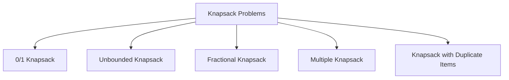

<!--
A program to understand and learn about knapsack problem using dynamic programming. The knapsack problem is a classic optimization problem that can be solved using dynamic programming techniques. The goal is to determine the maximum value that can be obtained by selecting items with given weights and values, without exceeding a specified weight limit.

-->

# Knapsack Problems Types 

1. **0/1 Knapsack Problem**: Each item can either be included or excluded from the knapsack. The goal is to maximize the total value without exceeding the weight limit.
2. **Unbounded Knapsack Problem**: Each item can be included multiple times. The goal is to maximize the total value without exceeding the weight limit.
3. **Fractional Knapsack Problem**: Items can be broken into smaller pieces. The goal is to maximize the total value without exceeding the weight limit, and you can take fractions of items.
4. **Multiple Knapsack Problem**: There are multiple knapsacks with different weight limits, and you need to maximize the total value across all knapsacks.
5. **Knapsack with Duplicate Items**: Similar to the unbounded knapsack, but with a limited number of each item available.

## Diagram

```
+-------------------+
| Knapsack Problems |
+-------------------+
| 1. 0/1 Knapsack   |
| 2. Unbounded      |
| 3. Fractional     |
| 4. Multiple       |
| 5. Duplicate      |
+-------------------+
```    

## Mermaid 



## Problem Statement

You are given a list of items, where each item has a weight and a value. You have a knapsack with a maximum weight capacity. Your task is to determine the maximum value you can achieve by selecting items to include in the knapsack without exceeding the weight capacity.

## Constraints

- 1 ≤ number of items ≤ 100
- 1 ≤ weight of each item ≤ 1000
- 1 ≤ value of each item ≤ 1000
- 1 ≤ knapsack capacity ≤ 1000
- The answer may be large, return it modulo 10^9 + 7

## Example

### Input

Items: [(weight=2, value=3), (weight=3, value=4), (weight=4, value=5)]
Knapsack capacity: 5

### Output

Maximum value: 7

## ELI5 Explanation of above test case

In this example, we have three items. The first item has a weight of 2 and a value of 3. The second item has a weight of 3 and a value of 4. The third item has a weight of 4 and a value of 5. We have a knapsack that can carry a maximum weight of 5. We want to find out the maximum value we can get by putting some of these items in the knapsack without exceeding the weight limit.

In this case, we can take the first item (weight 2, value 3) and the second item (weight 3, value 4). The total weight of these two items is 2 + 3 = 5, which is exactly the capacity of the knapsack. The total value of these two items is 3 + 4 = 7. Therefore, the maximum value we can achieve with the given items and knapsack capacity is 7.

---

## Test cases

### Test Case 1

**Input:**
Items: [(weight=1, value=2), (weight=2, value=3), (weight=3, value=4)]
Knapsack capacity: 6

**Output:**
Maximum value: 9

**Explanation:** You can take all three items since the total weight is 1 + 2 + 3 = 6, which is within the knapsack capacity. The total value is 2 + 3 + 4 = 9.