<!--
Graph COncepts Notes, explanation Very short but ELI5 to beginners.
Types, categories, examples, applications, etc.
Top 20% concepts that gives 80% of the value.

# 🟢 EASY (3)

# 🟡 MEDIUM (3)

# 🔴 HARD (3)

-->

# Graph Concepts Notes

## List of concepts to cover:

1. Graph representation (adjacency list, adjacency matrix)
2. Graph traversal (BFS, DFS)
3. Graph types (directed, undirected, weighted, unweighted)
4. Graph properties (connectedness, cycles, bipartite)
5. Graph algorithms (Dijkstra's, Prim's, Kruskal's, Topological Sort)
6. Graph applications (social networks, routing, scheduling)
7. Graph problems (shortest path, cycle detection, connectivity)
8. Graph complexity (time and space complexity of algorithms)
9. Graph theory basics (vertices, edges, degree, path, cycle)
10. Graph coloring and its applications (scheduling, register allocation)
11. Graph isomorphism and its implications in computer science
12. Graph traversal variations (iterative vs recursive, level order)
13. Graph connectivity and components (strongly connected, weakly connected)
14. Graph algorithms for specific problems (e.g., maximum flow, minimum cut)
15. Graph algorithms for dynamic graphs (e.g., dynamic connectivity, dynamic shortest path)
16. Graph algorithms for special graph types (e.g., trees, DAGs, bipartite graphs)
17. Graph algorithms for large-scale graphs (e.g., PageRank, community detection)

### Graph Concepts Cheat Sheet in table format:

| Concept                     | Description                                                                 |
| --------------------------- | --------------------------------------------------------------------------- |
| Graph representation        | Ways to represent a graph (adjacency list, adjacency matrix)                 |
| Graph traversal             | Methods to traverse a graph (BFS, DFS)                                               |
| Graph types                 | Different types of graphs (directed, undirected, weighted, unweighted)           |
| Graph properties            | Characteristics of graphs (connectedness, cycles, bipartite)                     |
| Graph algorithms            | Common algorithms for graphs (Dijkstra's, Prim's, Kruskal's, Topological Sort)         |
| Graph applications          | Real-world uses of graphs (social networks, routing, scheduling)                     |
| Graph problems              | Common problems involving graphs (shortest path, cycle detection, connectivity)

### 1. Graph representation (adjacency list, adjacency matrix)

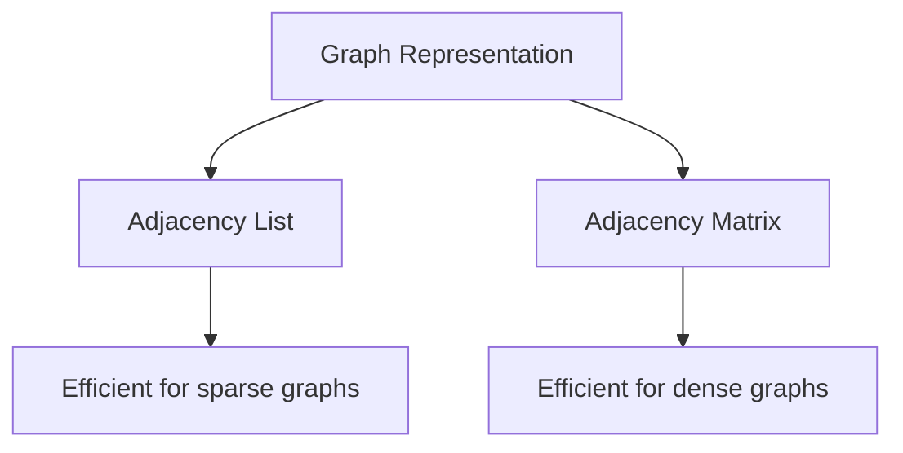

**Graph representation** refers to the way we represent a graph in memory. The two most common representations are:

1. **Adjacency List**: A list where each vertex has a list of its adjacent vertices. This is efficient for sparse graphs.
2. **Adjacency Matrix**: A 2D array where the entry at row i and column j indicates the presence (and possibly weight) of an edge between vertices i and j. This is efficient for dense graphs.

**Example diagram of graph:**

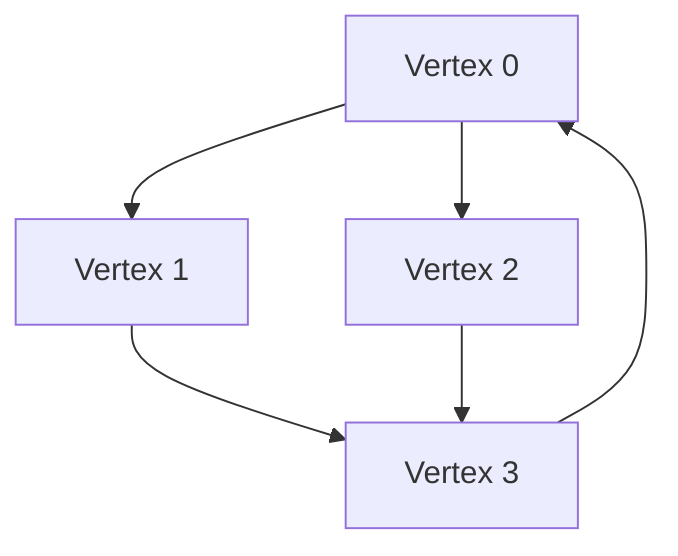

**Example of graph representation in C++:**

```cpp
// Adjacency List representation
//vector<vector<int>> adjList(n); // n is the number of vertices

vector<vector<int>> adjList = {
    {1, 2, 3}, // Vertex 0 is connected to vertices 1, 2, and 3
    {0, 3}, // Vertex 1 is connected to vertices 0 and 3
    {0, 3}, // Vertex 2 is connected to vertices 0 and 3
    {1, 2}  // Vertex 3 is connected to vertices 1 and 2
};

// Adjacency Matrix representation
//vector<vector<int>> adjMatrix(n, vector<int>(n, 0)); // n is the number of vertices

vector<vector<int>> adjMatrix = {
    {0, 1, 1, 1}, // Vertex 0 is connected to vertices 1, 2, and 3
    {1, 0, 0, 1}, // Vertex 1 is connected to vertices 0 and 3
    {1, 0, 0, 1}, // Vertex 2 is connected to vertices 0 and 3
    {1, 1, 1, 0}  // Vertex 3 is connected to vertices 0, 1, and 2
};

```

**Table for Matrix representation:**

|   | 0 | 1 | 2 | 3 |
|---|---|---|---|---|
| 0 | 0 | 1 | 1 | 1 |
| 1 | 1 | 0 | 0 | 1 |
| 2 | 1 | 0 | 0 | 1 |
| 3 | 1 | 1 | 1 | 0 |

### When to use which representation? 

- Use **adjacency list** when the graph is sparse (few edges compared to vertices) as it uses less memory and allows for faster traversal of adjacent vertices.
- Use **adjacency matrix** when the graph is dense (many edges compared to vertices) as it allows for faster edge lookups at the cost of increased memory usage.
- For algorithms that require frequent edge lookups (like Dijkstra's), an adjacency matrix may be more efficient, while for algorithms that require traversal of adjacent vertices (like DFS or BFS), an adjacency list may be more efficient.
- In practice, the choice of representation can also depend on the specific requirements of the problem being solved and the constraints of the input size.

**Example sparse graph diagram for adjacency list:**

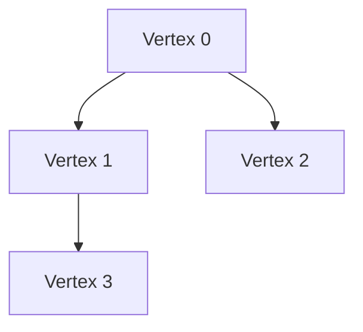

**Example graph diagram for adjacency matrix(dense graph):**

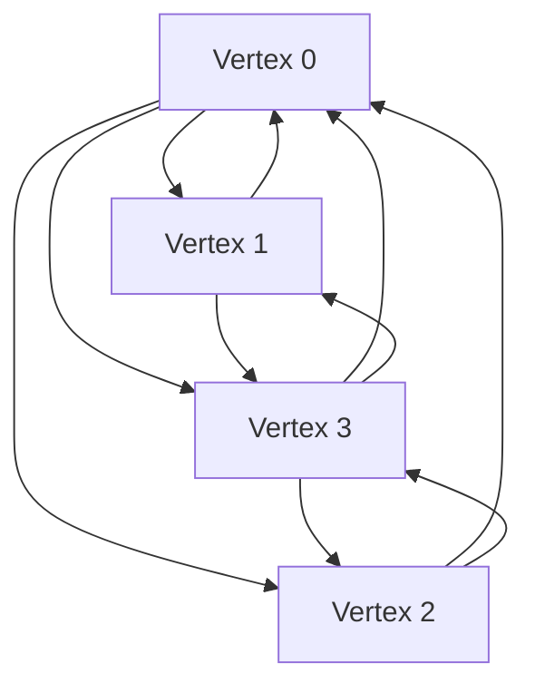

### When to take graph as DSA to store data?

- When the problem involves relationships between entities, such as social networks, transportation networks, or communication networks.
- When the problem requires traversal or searching through connected components, such as finding paths, cycles, or connectivity.
- When the problem involves optimization, such as finding the shortest path, minimum spanning tree, or maximum flow.
- When the problem involves scheduling or resource allocation, such as task scheduling or register allocation.

### When to take graph as DSA to solve problems?

- When the problem involves finding paths or cycles, such as in maze solving, route planning, or network flow problems.
- When the problem involves connectivity, such as in social network analysis, clustering, or community detection.
- When the problem involves optimization, such as in shortest path problems, minimum spanning tree problems, or maximum flow problems.
- When the problem involves scheduling or resource allocation, such as in task scheduling or register allocation problems.

### How to traverse a graph?

- Use **Depth-First Search (DFS)** for exploring as far as possible along each branch before backtracking.
- Use **Breadth-First Search (BFS)** for exploring all neighbors at the present depth before moving on to nodes at the next depth level.

#### ELI5 Explanation of BFS:

Imagine you are in a maze and you want to find the exit. You start at the entrance and look around to see all the paths you can take. You first explore all the paths that are one step away from you, then all the paths that are two steps away, and so on. This way, you are exploring the maze level by level, which is what BFS does.

**Graph for BFS traversal with at least three nodes in each level and 5 levels:**

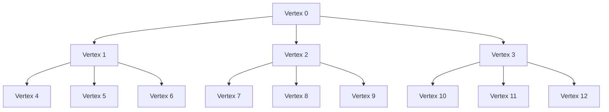

**A trace table for BFS traversal(code given below):**

| Step | Queue                | Visited Set     | Output          |
|------|--------------------|-----------------|-----------------|
| 1    | [0]                    | {0}                                          | Visited vertex: 0 |
| 2    | [1, 2, 3]              | {0, 1}                                       | Visited vertex: 1 |
| 3    | [2, 3, 4, 5, 6]        | {0, 1, 2}                                    | Visited vertex: 2 |
| 4    | [3,4,5,6,7,8,9]        | {0, 1, 2, 3}                                 | Visited vertex: 3 |
| 5    | [4,5,6,7,8,9,10,11,12] | {0, 1, 2, 3, 4}                              | Visited vertex: 4 |
| 6    | [5,6,7,8,9,10,11,12]   | {0, 1, 2, 3, 4, 5}                           | Visited vertex: 5 |
| 7    | [6,7,8,9,10,11,12]     | {0, 1, 2, 3, 4, 5, 6}                        | Visited vertex: 6 |
| 8    | [7,8,9,10,11,12]       | {0, 1, 2, 3, 4, 5, 6, 7}                     | Visited vertex: 7 |
| 9    | [8,9,10,11,12]         | {0, 1, 2, 3, 4, 5, 6, 7, 8}                  | Visited vertex: 8 |
| 10   | [9,10,11,12]           | {0, 1, 2, 3, 4, 5, 6, 7, 8, 9}               | Visited vertex: 9 |
| 11   | [10,11,12]             | {0, 1, 2, 3, 4, 5, 6, 7, 8, 9, 10}           | Visited vertex: 10 |
| 12   | [11,12]                | {0, 1, 2, 3, 4, 5, 6, 7, 8, 9, 10, 11}       | Visited vertex: 11 |
| 13   | [12]                   | {0, 1, 2, 3, 4, 5, 6, 7, 8, 9, 10, 11, 12}   | Visited vertex: 12 |

**CPP implementation of BFS:**

```cpp

#include <iostream>
#include <vector>
#include <queue>
#include <unordered_set>

void bfs(const std::vector<std::vector<int>>& graph, int start) {
    std::queue<int> q;
    std::unordered_set<int> visited;

    q.push(start);
    visited.insert(start);

    while (!q.empty()) {
        int vertex = q.front();
        q.pop();
        std::cout << "Visited vertex: " << vertex << std::endl;

        for (int neighbor : graph[vertex]) {
            if (visited.find(neighbor) == visited.end()) {// If neighbor has not been visited
                q.push(neighbor);
                visited.insert(neighbor);
            }
        }
    }
}

```

### ELI5 Explanation of DFS:

Imagine you are in a maze and you want to find the exit. You start at the entrance and look around to see all the paths you can take. You choose one path and follow it as far as it goes until you reach a dead end or the exit. If you reach a dead end, you backtrack to the last junction and try a different path. This way, you are exploring the maze depth-first, which is what DFS does.

**Graph for DFS traversal with at two nodes in each level and 5 levels depth:**

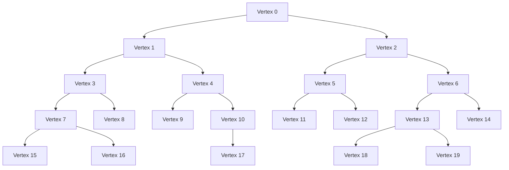

**A trace table for DFS traversal(code given below):**

| Step | Stack                | Visited Set     | Output          |
|------|--------------------|-----------------|-----------------|
| 1    | [0]                    | {0}                                          | Visited vertex: 0 |
| 2    | [1, 2]              | {0, 1}                                       | Visited vertex: 1 |
| 3    | [2, 3, 4]        | {0, 1, 2}                                    | Visited vertex: 2 |
| 4    | [3, 4, 5, 6]        | | {0, 1, 2, 3}                                 | Visited vertex: 3 |
| 5    | [4, 5, 6]        | {0, 1, 2, 3, 4}                              | Visited vertex: 4 |
| 6    | [5, 6]   | {0, 1, 2, 3, 4, 5}                           | Visited vertex: 5 |

**CPP implementation of DFS:**

```cpp

#include <iostream>
#include <vector>
#include <stack>
#include <unordered_set>

void dfs(const std::vector<std::vector<int>>& graph, int start) {
    std::stack<int> s;
    std::unordered_set<int> visited;

    s.push(start);
    visited.insert(start);

    while (!s.empty()) {
        int vertex = s.top();
        s.pop();
        std::cout << "Visited vertex: " << vertex << std::endl;

        for (int neighbor : graph[vertex]) {
            if (visited.find(neighbor) == visited.end()) {// If neighbor has not been visited
                s.push(neighbor);
                visited.insert(neighbor);
            }
        }
    }
}

```

## Graph types (directed, undirected, weighted, unweighted)

### Directed Graph

A graph where edges have a direction, indicating a one-way relationship. For example, in a Twitter follower graph, an edge from user A to user B indicates that A follows B, but not necessarily the other way around.

**Directed Graph Example(8 Vertices):**

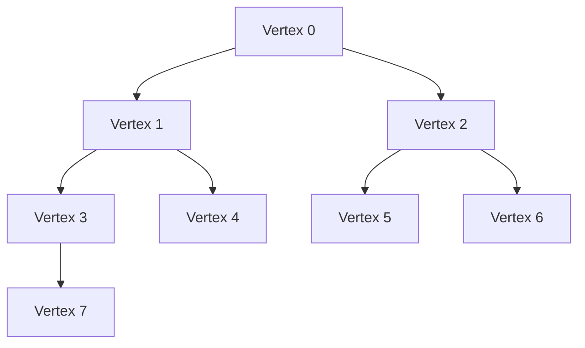

### Undirected Graph

A graph where edges do not have a direction, indicating a two-way relationship. For example, in a Facebook friendship graph, an edge between user A and user B indicates that they are friends, which is a mutual relationship.

**Undirected Graph Example(8 Vertices):**

```mermaid
graph TD
    A[Vertex 0] -- B[Vertex 1]
    A -- C[Vertex 2]
    B -- D[Vertex 3]
    B -- E[Vertex 4]
    C -- F[Vertex 5]
    C -- G[Vertex 6]
    D -- H[Vertex 7]
```

### Weighted Graph

A graph where edges have weights or costs associated with them. For example, in a road network graph, the weight of an edge could represent the distance or travel time between two locations.

**Weighted Graph Example(8 Vertices):**

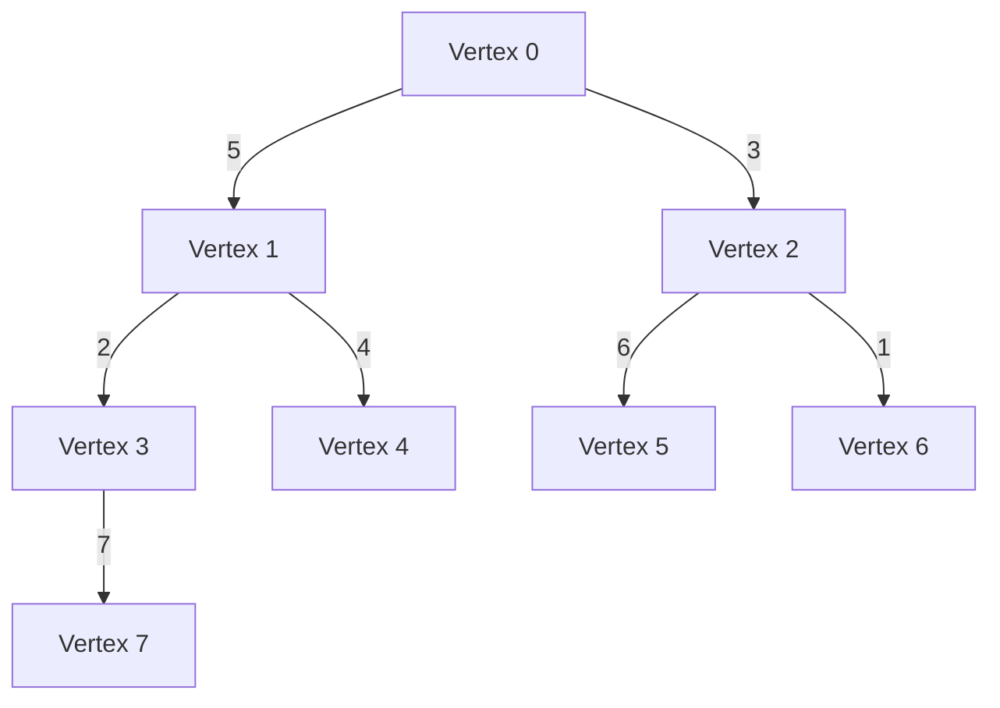

### Unweighted Graph

A graph where edges do not have weights or costs associated with them. For example, in a social network graph, the edges may simply represent connections between people without any additional information.

**Unweighted Graph Example(8 Vertices):**

```mermaid
graph TD
    A[Vertex 0] -- B[Vertex 1]
    A -- C[Vertex 2]
    B -- D[Vertex 3]
    B -- E[Vertex 4]
    C -- F[Vertex 5]
    C -- G[Vertex 6]
    D -- H[Vertex 7]
```

## Graph properties (connectedness, cycles, bipartite)

### Connected Graph

A graph where there is a path between every pair of vertices. For example, in a transportation network graph, a connected graph would mean that you can travel from any city to any other city through the network.

**Connected Graph Example(8 Vertices):**


### Disconnected Graph

A graph where there are at least two vertices that do not have a path between them. For example, in a social network graph, a disconnected graph could represent two groups of people who have no connections between them.

**Disconnected Graph Example(8 Vertices):**

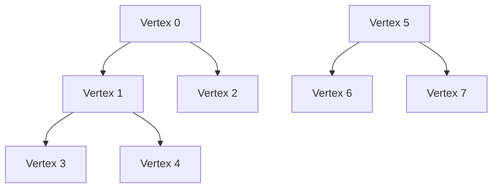

### Cycle

A path that starts and ends at the same vertex without repeating any edges. For example, in a graph representing a computer network, a cycle could represent a loop in the network where data can circulate indefinitely.

**Cycle Graph Example(8 Vertices):**

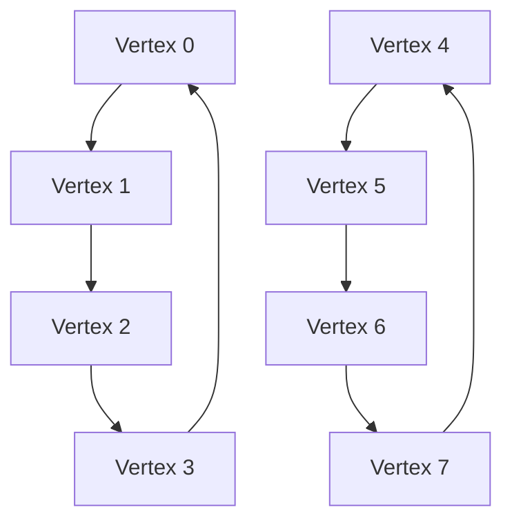

### Bipartite Graph

A graph whose vertices can be divided into two disjoint sets such that every edge connects a vertex from one set to a vertex from the other set. For example, in a job assignment problem, one set could represent workers and the other set could represent jobs, and edges could represent which workers are qualified for which jobs.

**Bipartite Graph Example(8 Vertices):**

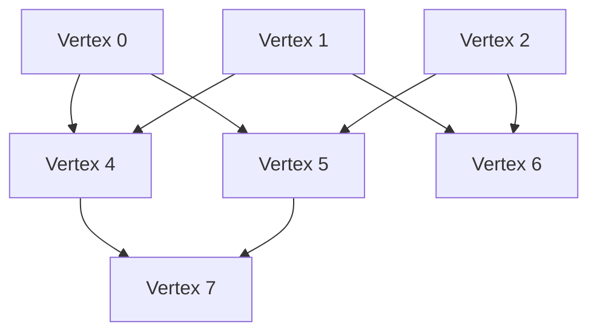

