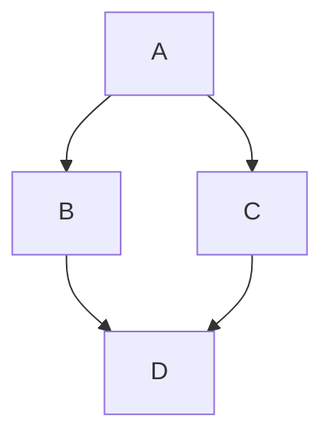

<!--A complete and detailed implementation of a topological sort algorithm that takes into account the dependencies and constraints provided. The algorithm will need to ensure that nodes are only included in the topological order when their dependencies have been satisfied, and it will need to handle cases where certain nodes may only become available for sorting after a certain number of other nodes have been visited.-->

# Topological Sort

**Definition:** Topological sort is a linear ordering of vertices in a directed acyclic graph (DAG) such that for every directed edge from vertex A to vertex B, vertex A comes before vertex B in the ordering.
**Applications:**

- Task scheduling
- Course prerequisite planning
- Build systems
- Data serialization

** A mermaid diagram to illustrate the concept of topological sort:*



**In this example, a valid topological order could be A, B, C, D or A, C, B, D. The key point is that A must come before both B and C, and both B and C must come before D.**

## Algorithm

1. **Kahn's Algorithm:**
   - Start with a list of nodes that have no incoming edges (i.e., nodes with zero in-degree).
   - While the list is not empty:
     - Remove a node from the list and add it to the topological order.
     - For each of its outgoing edges, reduce the in-degree of the neighboring nodes by 1.
     - If any neighboring node's in-degree becomes zero, add it to the list.
   - If all nodes are processed, return the topological order; otherwise, indicate that a cycle exists.

2. **Depth-First Search (DFS) Based Algorithm:**
   - Perform a DFS on the graph, keeping track of visited nodes and the recursion stack.
   - When a node finishes processing (i.e., all its neighbors have been visited), add it to the front of a list that will represent the topological order.
   - If a node is encountered that is already in the recursion stack, it indicates a cycle, and a topological sort is not possible.
   - After processing all nodes, the list will contain the nodes in reverse topological order, so reverse it before returning.

## Complexity

- Both Kahn's algorithm and the DFS-based algorithm have a time complexity of O(V + E), where V is the number of vertices and E is the number of edges in the graph.
- The space complexity is O(V) for both algorithms, as we need to store the graph and the visited nodes.
  
## Example Implementation (DFS-Based Algorithm)

```cpp

#include <iostream>
#include <vector>
#include <stack>

using namespace std;
void dfs(int node, vector<vector<int>>& graph, vector<bool>& visited, stack<int>& topoStack) {
    visited[node] = true;
    for (int neighbor : graph[node]) {
        if (!visited[neighbor]) {
            dfs(neighbor, graph, visited, topoStack);
        }
    }
    topoStack.push(node);
}