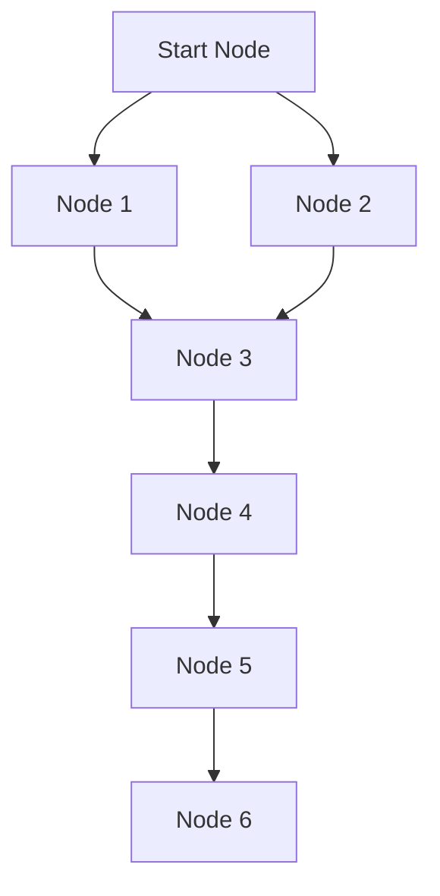

# Dijkstra's Algorithm COncept 

**Intro to Master, why it is created, what is it solving, how it is different from other algorithms, what is the main idea behind it, how it works, what are the steps involved in it, what are the applications of it, what are the advantages and disadvantages of it, what are the variations of it, what are the common mistakes to avoid while implementing it, what are the best practices to follow while implementing it, what are the common use cases of it, what are the real-world examples of it, what are the common interview questions related to it, how to prepare for those questions, how to optimize the implementation of it, how to analyze the time and space complexity of it, how to compare it with other algorithms for similar problems.**

## TOC

- [Dijkstra's Algorithm COncept](#dijkstras-algorithm-concept)
  - [TOC](#toc)
  - [Introduction](#introduction)
  - [Problem Statement](#problem-statement)
  - [Key Idea](#key-idea)
  - [Sample CPP implementation of entire Dijkstra's Algorithm](#sample-cpp-implementation-of-entire-dijkstras-algorithm)

** A Diagram of graph to see where a Dijkstra's is even necessary**
<!-- v -->


** ALWAYS VISIT THE CLOSEST UNVISITED NODE FIRST, THEN UPDATE THE DISTANCES TO ITS NEIGHBORS. REPEAT THIS PROCESS UNTIL ALL NODES HAVE BEEN VISITED OR THE TARGET NODE HAS BEEN REACHED.**

## Introduction

Dijkstra's algorithm is a popular algorithm used to find the shortest path between nodes in a graph, which may represent, for example, road networks. It was conceived by computer scientist Edsger W. Dijkstra in 1956 and published in 1959. The algorithm is widely used in various applications, including network routing protocols, geographic information systems (GIS), and many other fields where pathfinding is essential.

## Problem Statement

The problem that Dijkstra's algorithm solves is to find the shortest path from a source node to all other nodes in a weighted graph. The graph can be directed or undirected, and the weights on the edges represent the cost or distance between the nodes. The algorithm efficiently computes the minimum distance from the source node to each of the other nodes in the graph.

## Key Idea

The key idea behind Dijkstra's algorithm is to maintain a priority queue (or min-heap) to keep track of the nodes to be explored based on their current shortest distance from the source node. The algorithm repeatedly selects the node with the smallest distance, marks it as visited, and updates the distances to its neighboring nodes. This process continues until all nodes have been visited or the target node has been reached. The algorithm guarantees that once a node's shortest path is determined, it will not change, making it an efficient method for solving the shortest path problem in graphs with non-negative edge weights.

## Sample CPP implementation of entire Dijkstra's Algorithm

```cpp

#include <iostream>
#include <vector>
#include <queue>
#include <utility>
#include <limits>
using namespace std;

/**
 * Dijkstra's algorithm to find the shortest path from a source node to all other nodes in a weighted graph.
 * @param source The starting node for the algorithm.
 * @param graph The adjacency list representation of the graph, where each element is a vector of pairs (neighbor, weight).
 */
void dijkstra(int source, const vector<vector<pair<int, int>>>& graph) {
    int n = graph.size();// Number of nodes in the graph
    vector<int> dist(n, numeric_limits<int>::max());// Initialize distances to all nodes as infinity
    dist[source] = 0;// Distance to the source node is 0
    /**
     * Min-heap priority queue to store (distance, node) pairs.
     * The pair consists of the current shortest distance to a node and the node itself.
     * The priority queue ensures that the node with the smallest distance is processed first.
        @param pair<int, int> A pair where the first element is the distance and the second element is the node index.
     * The greater comparator is used to create a min-heap based on the distance.
        @param vector<pair<int, int>> A vector of pairs representing the neighbors and their corresponding edge weights for each node in the graph.
      @param greater<pair<int, int>> A comparator that ensures the priority queue behaves as a min-heap based on the distance value in the pair.
     */
    priority_queue<pair<int, int>, vector<pair<int, int>>, greater<pair<int, int>>> pq;
    pq.push({0, source});

    /* The main loop of Dijkstra's algorithm continues until the priority queue is empty.
     * In each iteration, the node with the smallest distance is processed.
     * If the current distance is greater than the recorded distance for that node, it is skipped.
     * Otherwise, the algorithm updates the distances to the neighboring nodes and adds them to the priority queue if a shorter path is found.
     */
    while (!pq.empty()) {
        int current_dist = pq.top().first;
        int current_node = pq.top().second;
        pq.pop();

        if (current_dist > dist[current_node]) {
            continue; // Skip if we have already found a shorter path
        }
        
        /* The algorithm iterates through the neighbors of the current node, calculating the new distance to each neighbor.
         * If the new distance is shorter than the previously recorded distance for that neighbor, it updates the distance and adds the neighbor to the priority queue for further exploration.
         */
        for (const auto& neighbor : graph[current_node]) {
            int next_node = neighbor.first;
            int weight = neighbor.second;
            int new_dist = current_dist + weight;

            if (new_dist < dist[next_node]) {
                dist[next_node] = new_dist;
                pq.push({new_dist, next_node});
            }
        }
    }

    // Print the shortest distances from the source node
    for (int i = 0; i < n; ++i) {
        cout << "Distance from node " << source << " to node " << i << " is " << dist[i] << endl;
    }
}

int main() {
    int n = 5; // Number of nodes
    vector<vector<pair<int, int>>> graph(n);

    // Adding edges to the graph (node1, node2, weight)
    graph[0].push_back({1, 10});
    graph[0].push_back({2, 5});
    graph[1].push_back({2, 2});
    graph[1].push_back({3, 1});
    graph[2].push_back({1, 3});
    graph[2].push_back({3, 9});
    graph[2].push_back({4, 2});
    graph[3].push_back({4, 4});
    graph[4].push_back({3, 6});

    int source = 0; // Starting node
    dijkstra(source, graph);

    return 0;
}
```

In this implementation, we define a function `dijkstra` that takes a source node and a graph represented as an adjacency list. The graph is a vector of vectors, where each inner vector contains pairs of neighboring nodes and their corresponding edge weights. The algorithm uses a priority queue to explore the nodes based on their current shortest distance from the source node. The distances are updated as the algorithm progresses, and the final shortest distances from the source node to all other nodes are printed at the end.