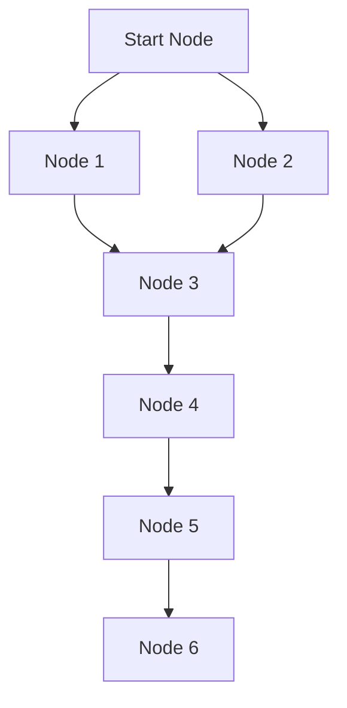

# Dijkstra's Algorithm COncept 

**Intro to Master, why it is created, what is it solving, how it is different from other algorithms, what is the main idea behind it, how it works, what are the steps involved in it, what are the applications of it, what are the advantages and disadvantages of it, what are the variations of it, what are the common mistakes to avoid while implementing it, what are the best practices to follow while implementing it, what are the common use cases of it, what are the real-world examples of it, what are the common interview questions related to it, how to prepare for those questions, how to optimize the implementation of it, how to analyze the time and space complexity of it, how to compare it with other algorithms for similar problems.**

## TOC

- [Dijkstra's Algorithm COncept](#dijkstras-algorithm-concept)
  - [TOC](#toc)
  - [Introduction](#introduction)
  - [Problem Statement](#problem-statement)
  - [Key Idea](#key-idea)
  - [Algorithm Steps](#algorithm-steps)
  - [Applications](#applications)
  - [Advantages and Disadvantages](#advantages-and-disadvantages)
  - [Variations](#variations)
  - [Common Mistakes to Avoid](#common-mistakes-to-avoid)
  - [Best Practices for Implementation](#best-practices-for-implementation)
  - [Common Use Cases](#common-use-cases)
  - [Real-World Examples](#real-world-examples)
  - [Common Interview Questions](#common-interview-questions)
  - [Preparation Tips for Interview Questions](#preparation-tips-for-interview-questions)
  - [Optimization Techniques](#optimization-techniques)
  - [Time and Space Complexity Analysis](#time-and-space-complexity-analysis)
  - [Comparison with Other Algorithms](#comparison-with-other-algorithms)
- [Conclusion](#conclusion)

** A Diagram of graph to see where a Dijkstra's is even necessary**
<!-- v -->

** ALWAYS VISIT THE CLOSEST UNVISITED NODE FIRST, THEN UPDATE THE DISTANCES TO ITS NEIGHBORS. REPEAT THIS PROCESS UNTIL ALL NODES HAVE BEEN VISITED OR THE TARGET NODE HAS BEEN REACHED.**