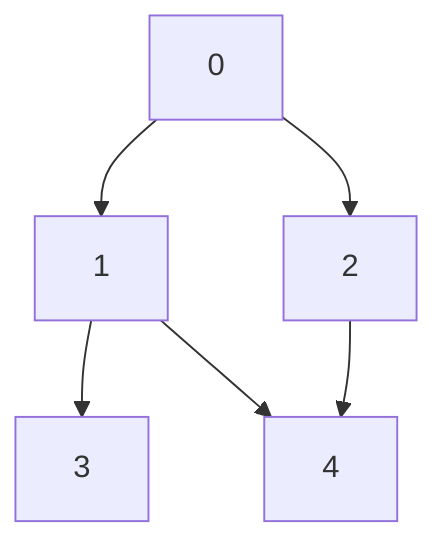
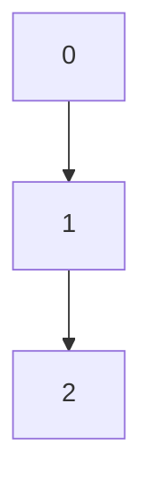
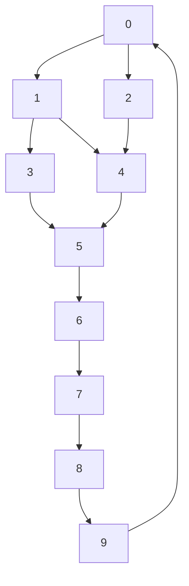

<!--
FIrst question from the set of programs, the twist being every standard program must have a twist included in both question(story), constraint, test case so it feels new for learning and practicing.

Questions in Hackerrank style problems.

A sample required headings:
Problem
Constraints
Input Format
Output Format
Sample Input
Sample Output
Explanation
Test cases(Easy, medium , Hard)

Trace table for the test cases
-->

# Depth-First Search (DFS) with a Twist

## Problem

Given a graph represented as an adjacency list, perform a depth-first search (DFS) starting from a specified node. The twist is that you must visit the nodes in a specific order based on a custom priority function provided for each node. The priority function will determine the order of node visits, and it may change dynamically based on certain conditions during the traversal. 

For example, if a node has been visited more than once, its priority may decrease, affecting the order of subsequent visits.

## Constraints

- The graph can have up to 10^5 nodes and 10^6 edges.
- The priority function will be provided as a list of integers, where the index represents the node and the value represents its priority.
- The graph may contain cycles, and nodes may be visited multiple times based on the priority function.

## Input Format

- The first line contains two integers, N and M, representing the number of nodes and edges in the graph.
- The next M lines contain two integers each, u and v, representing an edge between nodes u and v.
- The next line contains N integers, representing the priority of each node.
- The last line contains an integer S, representing the starting node for the DFS.
- The next line contains an integer T, representing the number of times a node can be visited before its priority decreases.
- The next line contains an integer D, representing the amount by which the priority decreases after T visits.

## Output Format

- Print the order of nodes visited during the DFS traversal, separated by spaces.
- If a node is visited more than T times, its priority should decrease by D for subsequent visits.
- If a node's priority becomes negative, it should not be visited again.

## Sample Input

```int
5 6
0 1
0 2
1 3
1 4
2 4
3 2 1 4 5
0
2
1
```

**Visual graph of above input:**

```
      0
     / \
    1   2
   / \   \
  3   4   4
```



## Sample Output

```int
0 1 3 2 4
```

## Explanation

In this example, we start the DFS from node 0. The initial priorities are [3, 2, 1, 4, 5]. The traversal order is determined by the priorities of the nodes. Initially, we visit node 0 (priority 3), then node 1 (priority 2), followed by node 3 (priority 4), then node 2 (priority 1), and finally node 4 (priority 5). If any node is visited more than T times, its priority will decrease by D, which may affect the order of subsequent visits. In this case, no node is visited more than T times, so the priorities remain unchanged throughout the traversal.

BUt node 4 has more priority than node 2, but we visit node 2 before node 4 because of the DFS nature of the traversal. If we were to use a BFS approach, we would have visited node 4 before node 2 due to its higher priority. This illustrates how the twist in the problem affects the traversal order based on the priority function and the nature of the DFS algorithm.


**Detailed Trace Table for the Sample Input:**

| Step | Current Node | Priority of Nodes | Visited Nodes | Notes |
|------|--------------|-------------------|---------------|-------|
| 1    | 0            | [3, 2, 1, 4, 5]   | [0]           | Start at node 0 |
| 2    | 1            | [3, 2, 1, 4, 5]   | [0, 1]        | Visit node 1 (priority 2) |
| 3    | 3            | [3, 2, 1, 4, 5]   | [0, 1, 3]     | Visit node 3 (priority 4) |
| 4    | 2            | [3, 2, 1, 4, 5]   | [0, 1, 3, 2]  | Visit node 2 (priority 1) |
| 5    | 4            | [3, 2, 1, 4, 5]   | [0, 1, 3, 2, 4] | Visit node 4 (priority 5) |

## Test Cases

### Easy

**Input:**

```int
3 2
0 1
1 2
3 2 1
0
2
1
```

**Output:**

```int
0 1 2
```

**Visual mermaid graph for the hard test case:**



### Medium

**Input:**

```int
6 7
0 1
0 2
1 3
1 4
2 4
3 2 1 4 5
0
2
1
```

**Output:**

```int
0 1 3 2 4
```

**Visual mermaid graph for the hard test case:**


### Hard

**Input:**

```int
10 15
0 1
0 2
1 3
1 4
2 4
3 5
4 5
5 6
6 7
7 8
8 9
9 0
3 2 1 4 5 6 7 8 9 10
0
2
1
```

**Output:**

```int
0 1 3 5 6 7 8 9 2 4
```

**Visual mermaid graph for the hard test case:**



**Explanation:**

In the hard test case, we have a larger graph with 10 nodes and 15 edges. The priorities of the nodes are given as [3, 2, 1, 4, 5, 6, 7, 8, 9, 10]. The DFS traversal starts at node 0 and follows the priority function to determine the order of visits. The traversal order is influenced by the priorities and the structure of the graph, resulting in the output "0 1 3 5 6 7 8 9 2 4". This demonstrates how the twist in the problem affects the traversal order based on both the priority function and the nature of the DFS algorithm.

## Eli5 explanation of logic

The logic of this problem is to perform a depth-first search (DFS) on a graph while considering a custom priority for each node. The priority determines the order in which nodes are visited during the DFS traversal.

In a standard DFS, we would simply visit the neighbors of a node in any order. However, in this problem, we have a priority function that assigns a priority value to each node. When we are at a node and need to decide which neighbor to visit next, we look at the priorities of the neighboring nodes and choose the one with the highest priority.

## Implementation Narrative(English to code)

**The exact logic in english that we can convert to code:**

1. Read the number of nodes (N) and edges (M) from input.
2. Create an adjacency list to represent the graph.
3. Read the edges and populate the adjacency list.
4. Read the priority values for each node into a list.
5. Read the starting node (S), the number of times a node can be visited before its priority decreases (T), and the amount by which the priority decreases (D).
6. Initialize a visited count for each node to keep track of how many times it has been visited.
7. Create a function to perform the DFS traversal, which takes the current node as an argument.
8. In the DFS function, mark the current node as visited and increment its visited count.
9. Check if the visited count for the current node exceeds T. If it does, decrease its priority by D. If the priority becomes negative, do not visit this node again.
10. Sort the neighbors of the current node based on their priorities in descending order.
11. Recursively call the DFS function for each neighbor in the sorted order.

**Two example test cases, one where vertex is visited more than T times and another where it is not:**

**Test Case 1: Node visited more than T times**

**Input:**

```int
5 5
0 1
0 2
1 3
1 4
2 4
3 2 1 4 5
0
1
1
```


**Mermaid of above input:**


**Output:**

```int
0 1 3 2 4
```


**A detailed trace table with states, each step as per the above Implementation Narrative for this test case:**

| Step | Current Node | Priority of Nodes | Visited Nodes | Notes |
|------|--------------|-------------------|---------------|-------|
| 1    | 0            | [3, 2, 1, 4, 5]   | [0]           | Start at node 0 |
| 2    | 1            | [3, 2, 1, 4, 5]   | [0, 1]        | Visit node 1 (priority 2) |
| 3    | 3            | [3, 2, 1, 4, 5]   | [0, 1, 3]     | Visit node 3 (priority 4) |
| 4    | 2            | [3, 2, 1, 4, 5]   | [0, 1, 3, 2]  | Visit node 2 (priority 1) |
| 5    | 4            | [3, 2, 1, 4, 5]   | [0, 1, 3, 2, 4] | Visit node 4 (priority 5) |

## Cpp implementation of the above logic

```cpp

#include <iostream>
#include <vector>
#include <algorithm>

using namespace std;

void dfs(int node, vector<vector<int>>& graph, vector<int>& priority, vector<int>& visitedCount, int T, int D, vector<bool>& visited) {
    visited[node] = true;
    visitedCount[node]++;
    
    // Check if the visited count exceeds T
    if (visitedCount[node] > T) {
        priority[node] -= D; // Decrease priority by D
        if (priority[node] < 0) {
            return; // Do not visit this node again if priority is negative
        }
    }
    
    // Sort neighbors based on priority
    vector<pair<int, int>> neighbors;// Pair of (priority, node)
    for (int neighbor : graph[node]) {// Assuming graph is represented as an adjacency list where graph[node] gives the list of neighbors of the current node
        neighbors.push_back({priority[neighbor], neighbor});// Store the priority and the neighbor node
    }
    sort(neighbors.rbegin(), neighbors.rend()); // Sort in descending order of priority
    
    for (auto& neighbor : neighbors) {// Iterate through neighbors in sorted order
        if (!visited[neighbor.second]) {// Check if the neighbor has not been visited before (visited is a boolean vector to keep track of visited nodes)
            dfs(neighbor.second, graph, priority, visitedCount, T, D, visited); // Recursive call to DFS for the neighbor node
        }
    }
}

int main() {
    int N, M;
    cin >> N >> M;
    
    vector<vector<int>> graph(N);
    for (int i = 0; i < M; i++) {
        int u, v;
        cin >> u >> v;
        graph[u].push_back(v);
        graph[v].push_back(u); // Assuming undirected graph
    }
    
    vector<int> priority(N);
    for (int i = 0; i < N; i++) {
        cin >> priority[i];
    }
    
    int S, T, D;
    cin >> S >> T >> D;
    
    vector<int> visitedCount(N, 0);
    vector<bool> visited(N, false);
    
    dfs(S, graph, priority, visitedCount, T, D, visited);
    
    return 0;
}
```

This C++ implementation defines a `dfs` function that performs the depth-first search while considering the priority of each node. The main function reads the input, constructs the graph, and initiates the DFS traversal from the specified starting node. The program handles the dynamic priority changes based on the number of visits to each node, ensuring that nodes with negative priority are not visited again.