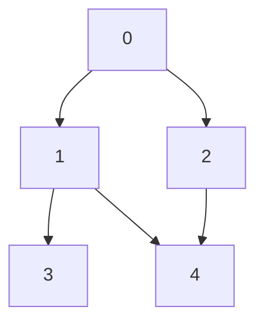
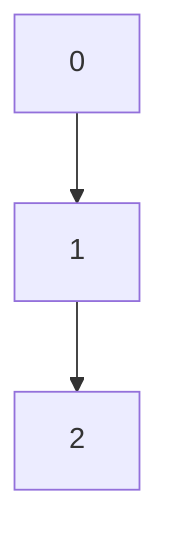
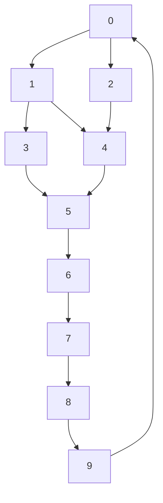

<!--
FIrst question from the set of programs, the twist being every standard program must have a twist included in both question(story), constraint, test case so it feels new for learning and practicing.

Questions in Hackerrank style problems.

A sample required headings:
Problem
Constraints
Input Format
Output Format
Sample Input
Sample Output
Explanation
Test cases(Easy, medium , Hard)

Trace table for the test cases
-->

# Depth-First Search (DFS) with a Twist

## Problem

Given a graph represented as an adjacency list, perform a depth-first search (DFS) starting from a specified node. The twist is that you must visit the nodes in a specific order based on a custom priority function provided for each node. The priority function will determine the order of node visits, and it may change dynamically based on certain conditions during the traversal. 

For example, if a node has been visited more than once, its priority may decrease, affecting the order of subsequent visits.

## Constraints

- The graph can have up to 10^5 nodes and 10^6 edges.
- The priority function will be provided as a list of integers, where the index represents the node and the value represents its priority.
- The graph may contain cycles, and nodes may be visited multiple times based on the priority function.

## Input Format

- The first line contains two integers, N and M, representing the number of nodes and edges in the graph.
- The next M lines contain two integers each, u and v, representing an edge between nodes u and v.
- The next line contains N integers, representing the priority of each node.
- The last line contains an integer S, representing the starting node for the DFS.
- The next line contains an integer T, representing the number of times a node can be visited before its priority decreases.
- The next line contains an integer D, representing the amount by which the priority decreases after T visits.

## Output Format

- Print the order of nodes visited during the DFS traversal, separated by spaces.
- If a node is visited more than T times, its priority should decrease by D for subsequent visits.
- If a node's priority becomes negative, it should not be visited again.

## Sample Input

```int
5 6
0 1
0 2
1 3
1 4
2 4
3 2 1 4 5
0
2
1
```

**Visual graph of above input:**

```
      0
     / \
    1   2
   / \   \
  3   4   4
```



## Sample Output

```int
0 1 3 2 4
```

## Explanation

In this example, we start the DFS from node 0. The initial priorities are [3, 2, 1, 4, 5]. The traversal order is determined by the priorities of the nodes. Initially, we visit node 0 (priority 3), then node 1 (priority 2), followed by node 3 (priority 4), then node 2 (priority 1), and finally node 4 (priority 5). If any node is visited more than T times, its priority will decrease by D, which may affect the order of subsequent visits. In this case, no node is visited more than T times, so the priorities remain unchanged throughout the traversal.

BUt node 4 has more priority than node 2, but we visit node 2 before node 4 because of the DFS nature of the traversal. If we were to use a BFS approach, we would have visited node 4 before node 2 due to its higher priority. This illustrates how the twist in the problem affects the traversal order based on the priority function and the nature of the DFS algorithm.


**Detailed Trace Table for the Sample Input:**

| Step | Current Node | Priority of Nodes | Visited Nodes | Notes |
|------|--------------|-------------------|---------------|-------|
| 1    | 0            | [3, 2, 1, 4, 5]   | [0]           | Start at node 0 |
| 2    | 1            | [3, 2, 1, 4, 5]   | [0, 1]        | Visit node 1 (priority 2) |
| 3    | 3            | [3, 2, 1, 4, 5]   | [0, 1, 3]     | Visit node 3 (priority 4) |
| 4    | 2            | [3, 2, 1, 4, 5]   | [0, 1, 3, 2]  | Visit node 2 (priority 1) |
| 5    | 4            | [3, 2, 1, 4, 5]   | [0, 1, 3, 2, 4] | Visit node 4 (priority 5) |

## Test Cases

### Easy

**Input:**

```int
3 2
0 1
1 2
3 2 1
0
2
1
```

**Output:**

```int
0 1 2
```

**Visual mermaid graph for the hard test case:**



### Medium

**Input:**

```int
6 7
0 1
0 2
1 3
1 4
2 4
3 2 1 4 5
0
2
1
```

**Output:**

```int
0 1 3 2 4
```

**Visual mermaid graph for the hard test case:**


### Hard

**Input:**

```int
10 15
0 1
0 2
1 3
1 4
2 4
3 5
4 5
5 6
6 7
7 8
8 9
9 0
3 2 1 4 5 6 7 8 9 10
0
2
1
```

**Output:**

```int
0 1 3 5 6 7 8 9 2 4
```

**Visual mermaid graph for the hard test case:**



**Explanation:**

In the hard test case, we have a larger graph with 10 nodes and 15 edges. The priorities of the nodes are given as [3, 2, 1, 4, 5, 6, 7, 8, 9, 10]. The DFS traversal starts at node 0 and follows the priority function to determine the order of visits. The traversal order is influenced by the priorities and the structure of the graph, resulting in the output "0 1 3 5 6 7 8 9 2 4". This demonstrates how the twist in the problem affects the traversal order based on both the priority function and the nature of the DFS algorithm.

After visiting