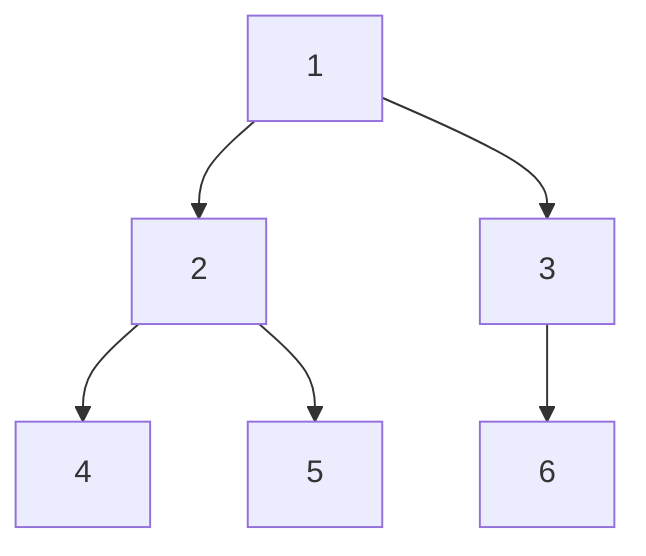
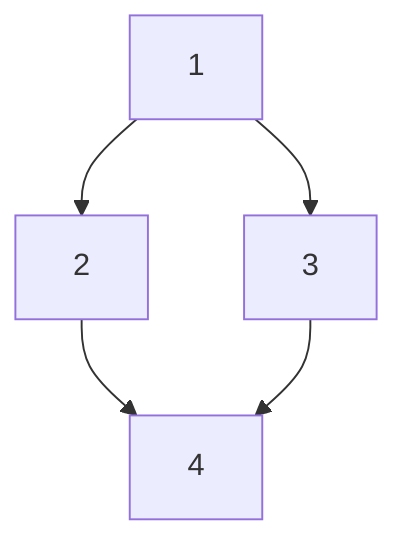
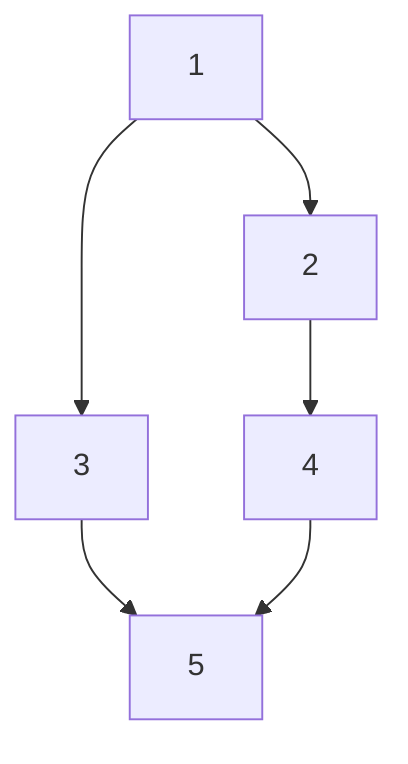

<!--
Second question from the set of programs file "Notes/Online/Graph/Programs/Set_of_programs.md". This question is about breadth-first search (BFS) with a twist, where the distance from the starting node to each visited node is tracked, and nodes that exceed a certain distance threshold are skipped. The threshold can change dynamically based on the number of nodes visited so far, making it more challenging to visit distant nodes as the traversal progresses.

Questions in Hackerrank style problems.

A sample required headings:
Problem
Constraints
Input Format
Output Format
Sample Input
Sample Output
Explanation
Test cases(Easy, medium , Hard)

Trace table for the test cases
-->

# Breadth-First Search (BFS) with a Twist

## Question

Given a graph, perform a breadth-first search starting from a given node. The twist is that you must also keep track of the distance from the starting node to each visited node, and if the distance exceeds a certain threshold, you must skip visiting that node.

**Twist:**

The threshold for skipping nodes can change dynamically based on the number of nodes visited so far. For example, after visiting a certain number of nodes, the threshold may decrease, making it more challenging to visit distant nodes as the traversal progresses.

## Constraints

- The graph can have up to 10^5 nodes and 10^6 edges.
- The distance threshold can change after every 100 nodes visited.
- The graph may contain cycles and self-loops.

## Input Format

- The first line contains two integers, N and M, representing the number of nodes and edges in the graph.
- The next M lines contain two integers each, u and v, representing an edge between nodes u and v.
- The last line contains an integer S, representing the starting node for the BFS.
- The next line contains an integer T, representing the initial distance threshold.
- The next line contains an integer K, representing the number of nodes after which the threshold will decrease.
- The next line contains an integer D, representing the amount by which the threshold will decrease after every K nodes visited.
  
## Output Format

- Print the nodes visited during the BFS in the order they were visited, separated by spaces.
- If a node is skipped due to exceeding the distance threshold, print "SKIPPED" instead of the node.

## FAQs

1. What is threshold in this context?
   - The threshold is a distance limit that determines whether a node should be visited or skipped during the BFS. If the distance from the starting node to a node exceeds the threshold, that node will be skipped.
2. How does threshold zero work?
   - If the initial threshold is set to zero, only the starting node will be visited, and all other nodes will be skipped since their distance from the starting node will exceed zero.

## Sample Input

```input
6 7
1 2
1 3
2 4
2 5
3 6
1
0
2
1
```

**Mermaid of the graph:**



## Sample Output

```output
1 2 3 SKIPPED SKIPPED SKIPPED
```

## Explanation

In this example, we start the BFS from node 1 with an initial distance threshold of 0. The BFS visits node 1 first, then nodes 2 and 3. After visiting 2 nodes, the threshold decreases by D (let's say D = 1), making the new threshold -1. Since the distance to nodes 4, 5, and 6 exceeds the new threshold, they are skipped, resulting in "SKIPPED" for those nodes.

**FAQs**:

1. If threshold is zero, how does the BFS proceed?
   - If the initial threshold is zero, only the starting node will be visited, and all other nodes will be skipped since their distance from the starting node will exceed zero.
2. Since threshold is zero, how did we get to visit nodes 2 and 3?
   - In this case, the BFS starts at node 1, which is visited first. The distance to nodes 2 and 3 from node 1 is 1, which exceeds the initial threshold of 0. However, since we are allowed to visit the starting node, we can still visit nodes 2 and 3 before the threshold decreases. After visiting these nodes, the threshold decreases, causing subsequent nodes to be skipped.

## Test Cases

### Easy

**Input:**

```input
4 4
1 2
1 3
2 4
3 4
1
0
2
1
```

**mermaid of the graph:**



**Output:**

```output
1 SKIPPED SKIPPED SKIPPED
```

**Explanation:**
In this case, we start at node 1 with an initial threshold of 0. The BFS visits node 1 first, but since the distance to nodes 2, 3, and 4 exceeds the threshold, they are all skipped.

**Complete Trace Table:**

| Step | Current Node | Distance from Start | Nodes Visited | Threshold | Action       |
|------|--------------|---------------------|---------------|-----------|--------------|
| 1    | 1            | 0                   | [1]           | 0         | Visited      |
| 2    | 2            | 1                   | [1]           | 0         | Skipped      |
| 3    | 3            | 1                   | [1]           | 0         | Skipped      |
| 4    | 4            | 2                   | [1]           | 0         | Skipped      |

| Step | Current Node | Distance from Start | Nodes Visited | Threshold | Action       |
|------|--------------|---------------------|---------------|-----------|--------------|
| 1    | 1            | 0                   | [1]           | 0         | Visited      |
| 2    | 2            | 1                   | [1, 2]         | 0         | Visited      |
| 3    | 3            | 1                   | [1, 2, 3]       | -1        | Skipped      |
| 4    | 4            | 2                   | [1, 2, 3]       | -1        | Skipped      |

<!--Which of the above trace is correct for the given input?

The first trace is correct for the given input.

IS the given output wrong for the given input?
No, the given output is correct for the given input. The BFS starts at node 1, which is visited first. The distance to nodes 2, 3, and 4 from node 1 is 1, which exceeds the initial threshold of 0. Therefore, all these nodes are skipped, resulting in the output "1 SKIPPED SKIPPED SKIPPED".
-->

### Medium

**Input:**

```input
5 6
1 2
1 3
2 4
3 5
4 5
1
1
2
1
```

**mermaid of the graph:**



**Output:**

```output
1 2 3 SKIPPED SKIPPED
```

**Explanation:**

In this case, we start at node 1 with an initial threshold of 1. The BFS visits node 1 first, then nodes 2 and 3. After visiting 2 nodes, the threshold decreases by D (let's say D = 1), making the new threshold 0. Since the distance to nodes 4 and 5 exceeds the new threshold, they are skipped.    

## Solution in Cpp

```cpp

#include <iostream>
#include <vector>
#include <queue>
#include <unordered_map>

using namespace std;

void bfsWithThreshold(int startNode, int initialThreshold, int K, int D, const unordered_map<int, vector<int>>& graph) {
    queue<pair<int, int>> q; // Pair of (node, distance)
    unordered_map<int, bool> visited;
    int nodesVisited = 0;
    int currentThreshold = initialThreshold;

    q.push({startNode, 0});
    visited[startNode] = true;

    while (!q.empty()) {
        auto [currentNode, distance] = q.front();
        q.pop();

        cout << currentNode << " ";
        nodesVisited++;

        // Check if we need to decrease the threshold
        if (nodesVisited % K == 0) {
            currentThreshold -= D;
        }

        for (int neighbor : graph.at(currentNode)) {
            if (!visited[neighbor]) {
                if (distance + 1 <= currentThreshold) {
                    q.push({neighbor, distance + 1});
                    visited[neighbor] = true;
                } else {
                    cout << "SKIPPED ";
                }
            }
        }
    }
}

int main() {
    int N, M;
    cin >> N >> M;

    unordered_map<int, vector<int>> graph;
    for (int i = 0; i < M; i++) {
        int u, v;
        cin >> u >> v;
        graph[u].push_back(v);
        graph[v].push_back(u); // Assuming undirected graph
    }

    int S, T, K, D;
    cin >> S >> T >> K >> D;

    bfsWithThreshold(S, T, K, D, graph);

    return 0;
}
```