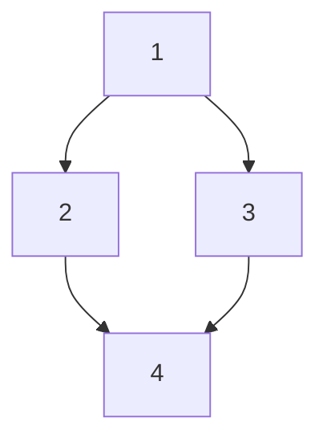

# BFS visuals

**Mermaids for different states of a sample graph to explain the BFS traversal with a twist(and depiction of skipped nodes, along with distance thresholds). Animation effect so use marp**

## Sample Input

```input
4 4
1 2
1 3
2 4
3 4
1
0
2
1
```

**Mermaid of the graph:*



