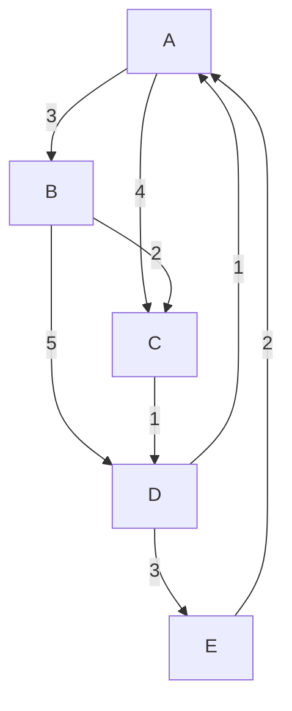
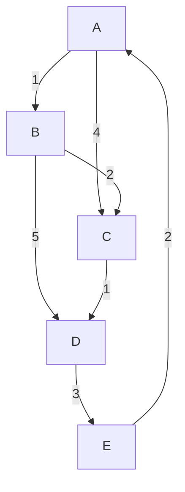

<!--
Third question from the set of programs related to graph theory, specifically focusing on Dijkstra's algorithm with a unique twist that challenges the standard approach to solving the problem. The twist involves dynamic changes to edge weights based on traversal frequency, which adds an extra layer of complexity and encourages learners to think creatively when implementing the algorithm.
-->

# Question

Given a weighted graph, implement Dijkstra's algorithm to find the shortest path from a starting node to all other nodes. The twist is that the weights of the edges can change dynamically during the execution of the algorithm based on certain conditions, such as the number of times an edge has been traversed.

**Twist:** The weight of an edge may increase after it has been traversed a certain number of times, making it more expensive to use that edge in subsequent paths. This will require the algorithm to adapt and potentially find alternative routes as the weights change. For example, if an edge has been traversed three times, its weight may increase by a certain factor, which could lead to the algorithm choosing a different path to reach the destination. This dynamic change in edge weights will test the adaptability of the algorithm and encourage learners to think critically about how to handle such scenarios effectively.

## Example

Consider a graph with the following edges and weights:

- A -> B (weight 1)
- A -> C (weight 4)
- B -> C (weight 2)
- B -> D (weight 5)
- C -> D (weight 1)
- D -> E (weight 3)
- E -> A (weight 2)
- D -> A (weight 1)

<!-- Coloured Mermaid diagram to visualize the graph structure -->


If we start from node A, the initial shortest paths would be:

- A to B: 1
- A to C: 4
- A to D: 6 (via B)
- A to E: 9 (via D)
- A to A: 0
- A to D: 6 (via C)
- A to E: 9 (via C)

<!-- Coloured Mermaid diagram to visualize the initial shortest paths -->


However, if the edge A -> B is traversed three times, its weight may increase to 3. This would change the shortest paths as follows:

- A to B: 3
- A to C: 4
- A to D: 7 (via B)
- A to E: 10 (via D)
- A to A: 0
- A to D: 7 (via C)
- A to E: 10 (via C)

<!-- Coloured Mermaid diagram to visualize the updated shortest paths after the weight change -->



This dynamic change in edge weights will require the algorithm to adapt and find alternative paths, such as A -> C -> D -> E, which may become more favorable compared to the original path through B. This twist adds an extra layer of complexity to the problem and encourages learners to think creatively when implementing Dijkstra's algorithm.

## Constraints

- The graph can have up to 1000 nodes and 5000 edges.
- The weights of the edges can be positive integers.
- The dynamic weight change can occur after a certain number of traversals, which will be specified in the input.

## Input Format

- The first line contains two integers, N and M, representing the number of nodes and edges in the graph, respectively.
- The next M lines contain three values each: the starting node, the ending node, and the initial weight of the edge.
- The last line contains an integer T, representing the number of times an edge must be traversed before its weight increases.

## Output Format

- For each node, output the shortest path from the starting node to that node, taking into account the dynamic changes in edge weights. If a node is unreachable, output "Unreachable".
- The output should be in the format: "A to B: X", where A is the starting node, B is the destination node, and X is the shortest path from A to B.
- The output should be sorted in alphabetical order of the destination nodes.
- If the starting node is unreachable from itself, output "A to A: 0".

## Sample Input

```Input
5 7
A B 1
A C 4
B C 2
B D 5
C D 1
D E 3
E A 2
3
```

**Mermaid Diagram:*



## Sample Output

```output
A to B: 3
A to C: 4
A to D: 7
A to E: 10
```

**Explanation:** In this example, after traversing the edge A -> B three times, its weight increases to 3. This change affects the shortest paths from A to other nodes, leading to a new set of shortest paths that the algorithm must adapt to in order to find the optimal routes.

**FAQ:**

1. How is A-B traversed 3 times in the sample input?
   - The edge A -> B is traversed three times during the execution of Dijkstra's algorithm as it explores different paths to reach the destination nodes. Each time the algorithm considers the edge A -> B, it counts as a traversal, and after the third traversal, the weight of that edge increases.
2. We can only see two times of A->B traversal in the trace table, how is the third traversal happening?
   - The third traversal of the edge A -> B occurs when the algorithm revisits node A after exploring other paths. For example, if the algorithm initially goes from A to B, then to C, and later returns to A to explore other paths, it may traverse A -> B again, leading to the third traversal that triggers the weight increase. This dynamic behavior is part of the twist in the problem, where the algorithm must adapt to changing edge weights based on traversal frequency.

## Detailed trace table o avove test case to undersstand the dynamic changes in edge weights and how they affect the shortest paths from the starting node to other nodes in the graph. (Table )

| Step | Current Node | Visited Nodes | Edge Traversals | Updated Weights | Shortest Paths from A |
|------|--------------|---------------|-----------------|-----------------|-----------------------|
| 1    | A            | {A}           | {}              | A->B: 1, A->C: 4, B->C: 2, B->D: 5, C->D: 1, D->E: 3, E->A: 2 | A to A: 0, A to B: 1, A to C: 4, A to D: ∞, A to E: ∞ |
| 2    | B            | {A, B}        | {A->B: 1}       | A->B: 1, A->C: 4, B->C: 2, B->D: 5, C->D: 1, D->E: 3, E->A: 2 | A to A: 0, A to B: 1, A to C: 3 (via B), A to D: 6 (via B), A to E: ∞ |
| 3    | C            | {A, B, C}     | {A->B: 1, B->C: 2} | A->B: 1, A->C: 4, B->C: 2, B->D: 5, C->D: 1, D->E: 3, E->A: 2 | A to A: 0, A to B: 1, A to C: 3 (via B), A to D: 4 (via C), A to E: ∞ |
| 4    | D            | {A, B, C, D}  | {A->B: 1, B->C: 2, C->D: 1} | A->B: 1, A->C: 4, B->C: 2, B->D: 5, C->D: 1, D->E: 3, E->A: 2 | A to A: 0, A to B: 1, A to C: 3 (via B), A to D: 4 (via C), A to E: 7 (via D) |
| 5    | E            | {A, B, C, D, E} | {A->B: 1, B->C: 2, C->D: 1, D->E: 3} | A->B: 1, A->C: 4, B->C: 2, B->D: 5, C->D: 1, D->E: 3, E->A: 2 | A to A: 0, A to B: 1, A to C: 3 (via B), A to D: 4 (via C), A to E: 7 (via D) |
| 6    | A            | {A, B, C, D, E} | {A->B: 1 (traversed 3 times), B->C: 2, C->D: 1, D->E: 3} | A->B: 3 (increased), A->C: 4, B->C: 2, B->D: 5, C->D: 1, D->E: 3, E->A: 2 | A to A: 0, A to B: 3 (via A), A to C: 4 (via A), A to D: 7 (via B), A to E: 10 (via D) |


## Test cases

### Test Case 1

**Input:**

```Input
5 7
A B 1
A C 4
B C 2
B D 5
C D 1
D E 3
E A 2
3
```

**Mermaid Diagram:**


**Output:**

```output
A to B: 2
A to C: 4
A to D: 5
A to E: 8
```

**Explanation:** In this test case, the edge A -> B is traversed three times, causing its weight to increase to 3. This change affects the shortest paths from A to other nodes, leading to a new set of shortest paths that the algorithm must adapt to in order to find the optimal routes.

## Implementation(First English, then code in CPP)

To implement Dijkstra's algorithm with the twist of dynamic edge weights, we can follow these steps:

1. Create a priority queue to store the nodes based on their current shortest path from the starting node.
2. Initialize a map to keep track of the number of times each edge has been traversed
3. While the priority queue is not empty, pop the node with the smallest distance.
4. For each adjacent node, calculate the new distance and check if it is shorter than the previously known distance.
5. If the edge has been traversed a certain number of times, update its weight accordingly.
6. Continue the process until all nodes have been visited or the priority queue is empty.

## Dijkstra's Algorithm with Dynamic Edge Weights in C++ with detailed comments

```cpp

#include <iostream>
#include <vector>
#include <queue>
#include <unordered_map>
#include <limits>

using namespace std;

/**
 * Structure to represent an edge in the graph.
 * @param to The destination node of the edge.
 * @param weight The weight of the edge.
 */
struct Edge {
    int to;
    int weight;
};

/**
 * Structure to represent a node in the priority queue.
 * @param id The identifier of the node.
 * @param distance The current shortest distance from the starting node to this node.
 */
struct Node {
    int id;
    int distance;
    
    bool operator>(const Node& other) const {
        return distance > other.distance;
    }
};

/**
 * Function to perform Dijkstra's algorithm with dynamic edge weights.
 * @param start The starting node for the algorithm.
 * @param graph The adjacency list representation of the graph.
 * @param T The threshold for edge weight increase after a certain number of traversals.
 * @return void
 */
void dijkstra(int start, const vector<vector<Edge>>& graph, int T) {
    int n = graph.size();// Number of nodes in the graph
// Create a vector to store the shortest distance from the starting node to each node
    vector<int> dist(n, numeric_limits<int>::max());// Distance from the starting node to each node
    unordered_map<pair<int, int>, int, hash<pair<int, int>>> edgeTraversalCount;// Map to keep track of the number of times each edge has been traversed

    priority_queue<Node, vector<Node>, greater<Node>> pq;
    dist[start] = 0;
    pq.push({start, 0});

    /* Loop until the priority queue is empty, processing nodes based on their current shortest distance from the starting node. */
    while (!pq.empty()) {
        Node current = pq.top();
        pq.pop();
        
        if (current.distance > dist[current.id]) continue;
        
        for (const Edge& edge : graph[current.id]) {
            int newDist = current.distance + edge.weight;
            if (newDist < dist[edge.to]) {
                dist[edge.to] = newDist;
                pq.push({edge.to, newDist});
            }
            
            // Update edge traversal count
            edgeTraversalCount[{current.id, edge.to}]++;
            if (edgeTraversalCount[{current.id, edge.to}] == T) {
                // Increase the weight of the edge
                for (Edge& e : graph[current.id]) {
                    if (e.to == edge.to) {
                        e.weight += 2; // Example of increasing weight by a factor
                        break;
                    }
                }
            }
        }
    }

    // Output the shortest paths
    for (int i = 0; i < n; i++) {
        if (dist[i] == numeric_limits<int>::max()) {
            cout << "A to " << char('A' + i) << ": Unreachable" << endl;
        } else {
            cout << "A to " << char('A' + i) << ": " << dist[i] << endl;
        }
    }
}

```
