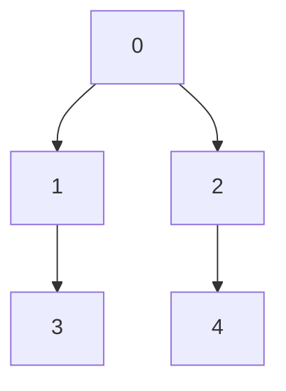
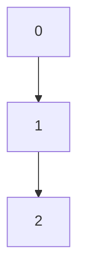
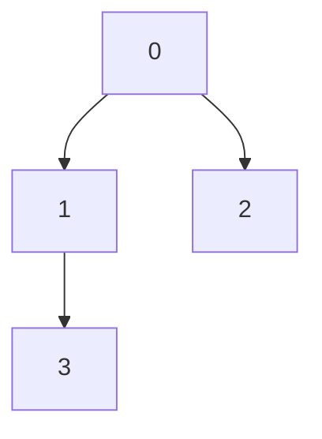
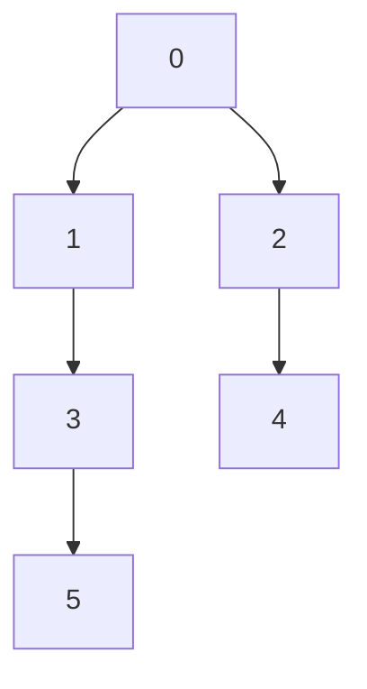

<!--
Fourth question from the set of programs related to graph theory, specifically focusing on topological sorting. The twist in this question will involve a unique constraint that challenges the standard approach to topological sorting, making it an engaging problem for learners to solve.
-->

# Question

Given a directed acyclic graph (DAG), perform a topological sort to determine the order of nodes. The twist is that certain nodes may have dependencies that can only be resolved after visiting a specific number of other nodes, adding an additional layer of complexity to the sorting process.

**Twist:** Some nodes may only become available for sorting after a certain number of other nodes have been visited. For example, a node may require that at least three other nodes have been visited before it can be included in the topological order. This will require careful planning and consideration of the dependencies between nodes to successfully complete the topological sort.

## Constraints

- The graph will be represented as an adjacency list.
- The number of nodes in the graph will be between 1 and 1000.
- The dependencies for each node will be provided as a list of integers, where each integer represents the number of nodes that must be visited before the node can be included in the topological order.
- The graph will be a DAG, meaning there will be no cycles.
- The output should be a valid topological order of the nodes, taking into account the dependencies and constraints provided.

## Input Format

- The first line contains an integer `n`, the number of nodes in the graph.
- The next `n` lines each contain a list of integers, where the first integer represents the number of dependencies for the node, followed by the indices of the nodes that must be visited before it can be included in the topological order.
- The last line contains an integer `m`, the number of edges in the graph, followed by `m` lines each containing two integers `u` and `v`, representing a directed edge from node `u` to node `v`.
- The final line contains an integer `k`, representing the number of nodes that must be visited before certain nodes can be included in the topological order.
  
## Output Format

- A single line containing the topological order of the nodes, separated by spaces. If there are multiple valid topological orders, any one of them can be returned. If it is not possible to perform a topological sort due to the constraints, return an empty list or indicate that no valid order exists.
- The output should take into account the dependencies and constraints provided, ensuring that nodes are only included in the topological order when their dependencies have been satisfied.

## Example

### Input

```grid
5
0
1 0
1 0
2 1 2
1 3
4
0 1
0 2
1 3
2 4
3
```



### Output

```integers
0 1 2 3 4
```

### Explanation

In this example, we have 5 nodes with the following dependencies:

- Node 0 has no dependencies.
- Node 1 depends on node 0.
- Node 2 depends on node 0.
- Node 3 depends on nodes 1 and 2.
- Node 4 depends on node 3.

The topological order that satisfies these dependencies is `0 1 2 3 4`.

## Test Cases(Easy, Medium, Hard)

### Test Case 1 (Easy)

#### Input

```grid
3
0
1 0
1 0
2
0 1
1 2
1
```



#### Output

```integers
0 1 2
```

#### Explanation

In this test case, we have 3 nodes with the following dependencies:

- Node 0 has no dependencies.
- Node 1 depends on node 0.
- Node 2 depends on node 0.
- The topological order that satisfies these dependencies is `0 1 2`.

### Test Case 2 (Medium)

#### Input

```grid
4
0
1 0
1 0
2 1 2
3
0 1
0 2
1 3
2
```



#### Output

```integers
0 1 2 3
```

#### Explanation

In this test case, we have 4 nodes with the following dependencies:

- Node 0 has no dependencies.
- Node 1 depends on node 0.
- Node 2 depends on node 0.
- Node 3 depends on nodes 1 and 2.
- The topological order that satisfies these dependencies is `0 1 2 3`.

### Test Case 3 (Hard)

#### Input

```grid
6
0
1 0
1 0
2 1 2
1 3
1 4
5
0 1
0 2
1 3
2 4
3 5
2
```



#### Output

```integers
0 1 2 3 4 5
```

#### Explanation

In this test case, we have 6 nodes with the following dependencies:

- Node 0 has no dependencies.
- Node 1 depends on node 0.
- Node 2 depends on node 0.
- Node 3 depends on nodes 1 and 2.
- Node 4 depends on node 3.
- Node 5 depends on node 4.
- The topological order that satisfies these dependencies is `0 1 2 3 4 5`.

## Solution Approach

To solve this problem, we can use a modified version of Kahn's algorithm for topological sorting. The key difference is that we need to account for the additional constraints on when certain nodes can be included in the topological order based on the number of nodes visited.

1. We will maintain a count of the number of dependencies for each node and a queue to keep track of nodes that are ready to be included in the topological order.
2. We will also maintain a count of how many nodes have been visited so far, and we will only add nodes to the queue when their dependencies have been satisfied and the required number of nodes have been visited.
3. We will continue this process until we have either included all nodes in the topological order or determined that it is not possible to include all nodes due to the constraints.
4. If we successfully include all nodes, we will return the topological order. If not, we will return an indication that no valid order exists.


### Code Implementation

```cpp

#include <iostream>
#include <vector>
#include <queue>
#include <unordered_map>

using namespace std;

vector<int> topologicalSortWithTwist(int n, vector<vector<int>>& dependencies, vector<pair<int, int>>& edges, int k) {
    // Create an adjacency list and a degree count for each node
    unordered_map<int, vector<int>> adjList;
    vector<int> inDegree(n, 0);
    
    for (auto& edge : edges) {
        adjList[edge.first].push_back(edge.second);
        inDegree[edge.second]++;
    }
    
    // Queue to keep track of nodes with no dependencies
    queue<int> q;
    for (int i = 0; i < n; i++) {
        if (inDegree[i] == 0) {
            q.push(i);
        }
    }
    
    vector<int> topologicalOrder;
    int visitedCount = 0;
    
    while (!q.empty()) {
        int node = q.front();
        q.pop();
        
        // Check if the node can be included based on the twist condition
        if (visitedCount >= k) {
            topologicalOrder.push_back(node);
            visitedCount++;
            
            for (int neighbor : adjList[node]) {
                inDegree[neighbor]--;
                if (inDegree[neighbor] == 0) {
                    q.push(neighbor);
                }
            }
        } else {
            // If the node cannot be included yet, we need to check its dependencies
            bool canInclude = true;
            for (int dep : dependencies[node]) {
                if (find(topologicalOrder.begin(), topologicalOrder.end(), dep) == topologicalOrder.end()) {
                    canInclude = false;
                    break;
                }
            }
            if (canInclude) {
                topologicalOrder.push_back(node);
                visitedCount++;
                
                for (int neighbor : adjList[node]) {
                    inDegree[neighbor]--;
                    if (inDegree[neighbor] == 0) {
                        q.push(neighbor);
                    }
                }
            } else {
                // If the node cannot be included, we need to recheck it later
                q.push(node);
            }
        }
    }
    
    // Check if we were able to include all nodes
    if (topologicalOrder.size() != n) {
        return {}; // No valid order exists
    }
    
    return topologicalOrder;
}
```

